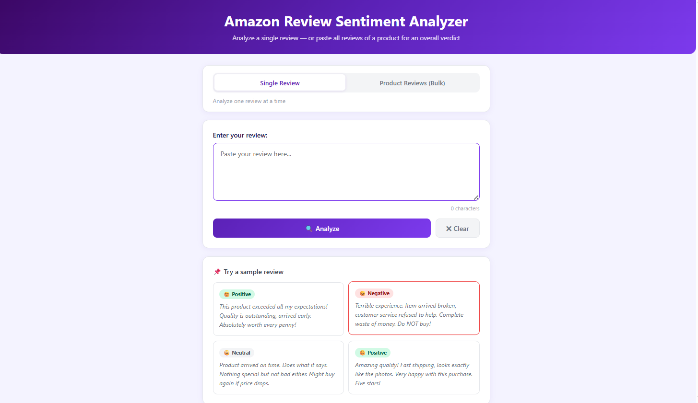
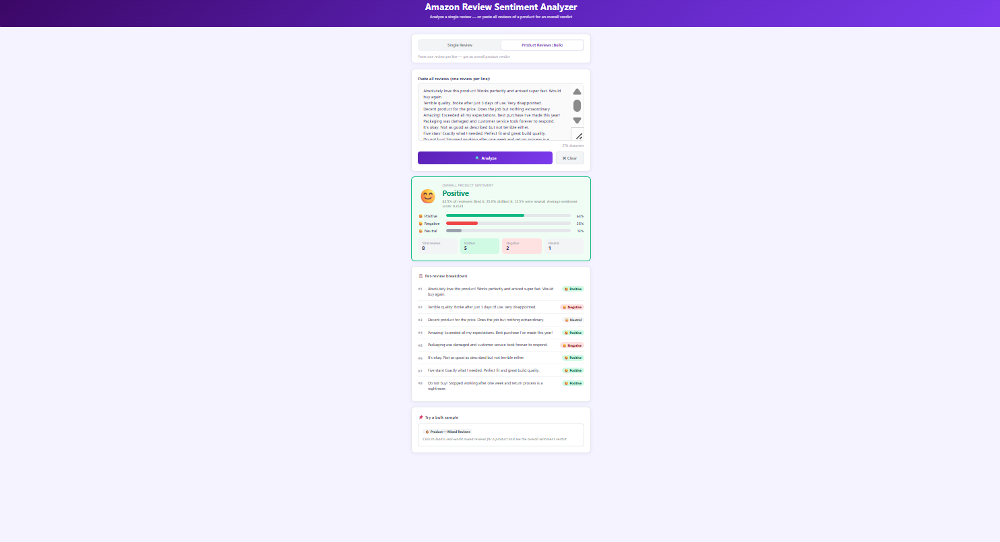
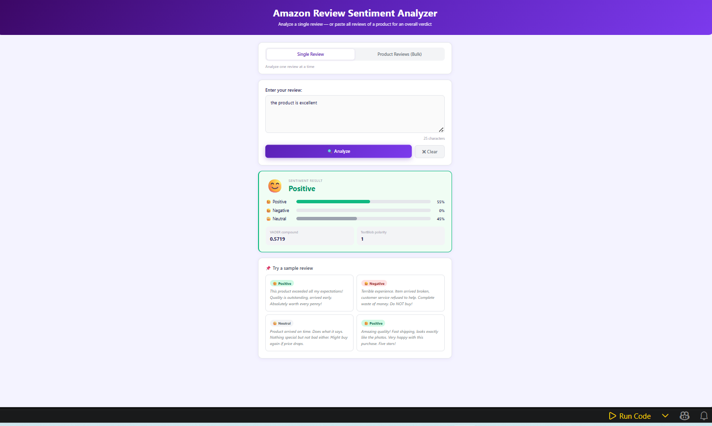

# Sentiment Analysis Web Application

A Machine Learning and Natural Language Processing (NLP) based web application that analyzes customer or product reviews and classifies them as **Positive** or **Negative** sentiment.

## Live Demo
https://sentiment-analysis-project-ezbd.onrender.com/

## Overview

This project is designed to perform sentiment analysis on textual reviews using a trained machine learning model. Users can enter a review through the web interface, and the application predicts the sentiment in real time.

The application demonstrates the practical implementation of:

* Text preprocessing
* NLP techniques
* Machine Learning classification
* Web application deployment using Flask

---

## Features

* Real-time sentiment prediction
* Positive and negative review classification
* Simple and responsive user interface
* NLP-based text processing
* Machine Learning model integration
* Easy-to-use web application

---

## Technologies Used

* Python
* Flask
* Scikit-learn
* Pandas
* Natural Language Processing (NLP)
* HTML
* CSS

---

## Project Structure

```plaintext id="lvb3ub"
sentiment-analysis/
│
├── app.py
├── model.pkl
├── vectorizer.pkl
├── requirements.txt
├── templates/
├── static/
├── screenshots/
│   ├── sentiment_input_page.png
│   ├── product_review_analysis.png
│   ├── positive_sentiment_result.png
│   └── negative_sentiment_review.png
│
└── README.md
```

---

## Installation & Setup

### Clone the Repository

```bash id="z3kmhj"
git clone <your-github-repository-link>
```

### Navigate to the Project Directory

```bash id="ud0f8m"
cd sentiment-analysis
```

### Install Required Dependencies

```bash id="3m4s43"
pip install -r requirements.txt
```

### Run the Application

```bash id="kfl8db"
python app.py
```

### Access the Application

Open your browser and visit:

```plaintext id="72x3tx"
http://127.0.0.1:5000
```

---

# Application Screenshots

## Sentiment Input Interface



---

## Product Review Analysis



---

## Positive Sentiment Prediction



---

## Negative Sentiment Prediction


---

## Future Enhancements

* Add Neutral sentiment classification
* Improve prediction accuracy
* Deploy the application on cloud platforms
* Add graphical analytics dashboard
* Support multilingual sentiment analysis

---

## Author

**Akram Hussain M**

---

## License

This project is developed for educational and learning purposes.
